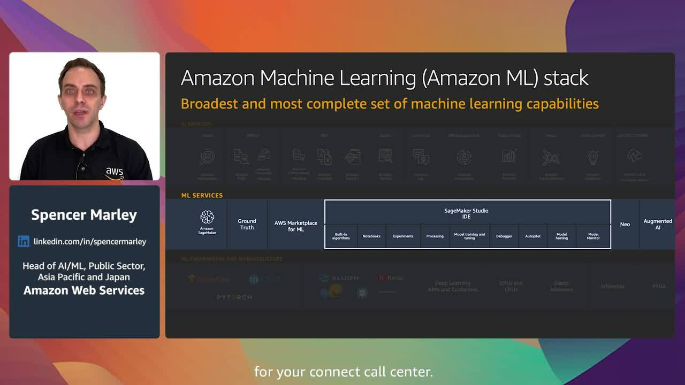

+++
title = "Accelerating machine learning to achieve your mission"
description = "Artificial intelligence (AI) and machine learning (ML) hold the promise of transforming industries, increasing efficiencies, and helping to spur innovation. In this session, learn how AWS customers have been successful in introducing AI and ML to power your mission. Hear how customers like Beth Israel Deaconess Medical Center, FINRA, and Transport for South Wales are working with AWS to align teams, drive ML adoption, and improve citizen services."
chapter = false
difficulty = "200"
time = "25 minutes"
inlists = true
hidden = false
+++

Artificial intelligence (AI) and machine learning (ML) hold the promise of transforming industries, increasing efficiencies, and helping to spur innovation. In this session, learn how AWS customers have been successful in introducing AI and ML to power your mission. Hear how customers like Beth Israel Deaconess Medical Center, FINRA, and Transport for South Wales are working with AWS to align teams, drive ML adoption, and improve citizen services.

>  **Speakers: Spencer Marley, Head of AI/ML, Public Sector, Asia Pacific and Japan, AWS** 
