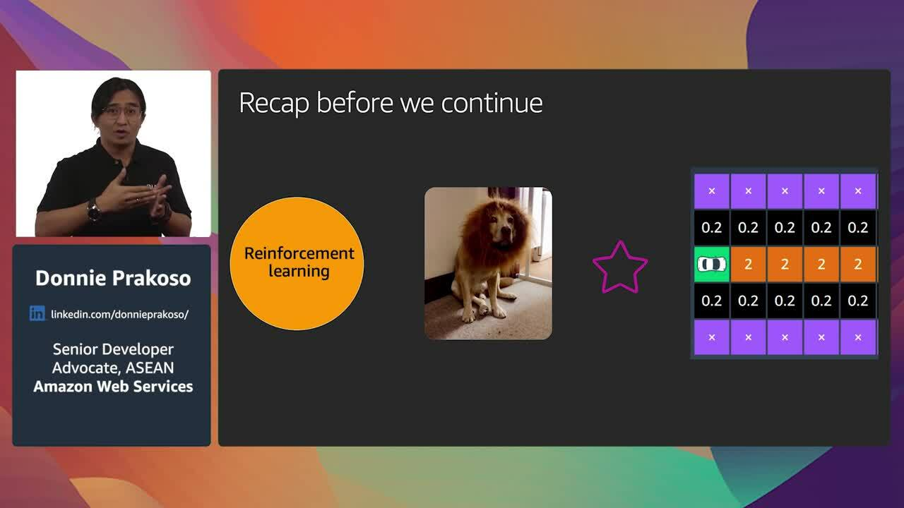

+++
title = "Getting started with AWS DeepRacer"
description = "Artificial intelligence (AI) and machine learning (ML) help organizations improve outcomes with automation, predictive insights, natural language interactions, and data-driven decision making. The AWS Well-Architected Framework helps cloud architects build secure and resilient infrastructure for their applications and workloads. In this white boarding session, we will walk through designing an ML application guided by the AWS Well Architected Framework’s five pillars: Operational excellence, security, reliability, performance efficiency, and cost optimization."
chapter = false
difficulty = "200"
time = "35 minutes"
inlists = true
hidden = false
+++

Artificial intelligence (AI) and machine learning (ML) help organizations improve outcomes with automation, predictive insights, natural language interactions, and data-driven decision making. The AWS Well-Architected Framework helps cloud architects build secure and resilient infrastructure for their applications and workloads. In this white boarding session, we will walk through designing an ML application guided by the AWS Well Architected Framework’s five pillars: Operational excellence, security, reliability, performance efficiency, and cost optimization.

{:target="_blank"}

>  **Speakers: Donnie Prakoso, Senior Developer Advocate, ASEAN, AWS** 
