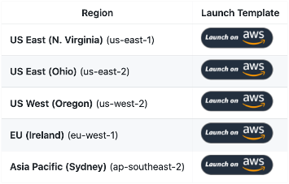

+++
title = "2. Solution Deployment"
date = 2019-11-18T17:11:28+11:00
weight =5
+++
<link rel="stylesheet" href="/static/css/virtual-proctor.css">

## Solution Deployment

This solution is deployed through a QuickLink provided in the GitHub repository.The QuickLink launches a CloudFormation stack in your AWS account. The template will build all the required resources.

> Note: In future you may want to use this repository as the basis of your own website. If this is the case, take a look at the file `CONTRIBUTING.md` where the authors run you through deploying a customised version of the Web UI.

### Deploy the solution to your account
1.	Log into your AWS account on the console
2.	In another browser tab, navigate to:
https://github.com/aws-samples/amazon-rekognition-virtual-proctor
3.	Select the QuickLink for your closest AWS region

Now HTML

quicklink_regions.png tre

## Workflows
### Register a new face to the collection:
1)	User clicks “Add a new user”.
2)	The website prompts the user to select an image of the new user from their hard-drive.
3)	The website prompts the user to provide a name (fullName) for the new image.
4)	The website calls the API “/faces/index” with the POST method, passing the image and the name.
5)	The AWS API Gateway has LAMBDA_PROXY integration so it sends the data to the IndexFaceFunction Lambda function as-is.
6)	The IndexFaceFunction Lambda function generates a unique reference ID.
7)	The IndexFaceFunction Lambda function calls the Rekognition IndexFaces method to index the face with the unique reference ID and stores it in an existing Rekognition collection.
8)	The IndexFaceFunction Lambda function stores the reference ID and corresponding name (fullName) in the DynamoDB table.
9)	If all processing is successful, the IndexFaceFunction Lambda function returns a HTTP 200 status code.

### Process a new image
1)	The website continually captures new images from the web-cam.
2)	It calls the API “/process” with the POST method, passing only the image.
3)	The AWS API Gateway has LAMBDA_PROXY integration and sends the data to the ProcessImageFunction Lambda function as-is.
4)	The ProcessImageFunction Lambda function calls the Rekognition DetectLabels method to find all labels about the image that have a confidence score of greater than our set threshold (default 85%).
5)	The ProcessImageFunction Lambda function filters the labels to count how many occurrences of “Person” are detected.
6)	The ProcessImageFunction Lambda function filters the labels against the specified objects of interest (e.g. mobile phone) to determine if any such objects are detected.
7)	The ProcessImageFunction Lambda function calls the Rekognition SearchFacesByImage method to check if the largest face in the image matches an indexed face in the Rekognition collection. If a match is found, the corresponding full name for face is looked up in the DynamoDB table.
8)	The ProcessImageFunction Lambda function calls the Rekognition DetectFaces method to check that there is one face, and only 1 face in the image
9)	The ProcessImageFunction Lambda function calls the Rekognition DetectModerationLabels method to find all moderation labels (such as explicit adult content or violent content) about the image that have a confidence score of greater than the set threshold (default 85%).
10)	If all processing is successful, the Lambda function returns a HTTP 200 status code and includes the results as a JSON string in the HTTP body.

